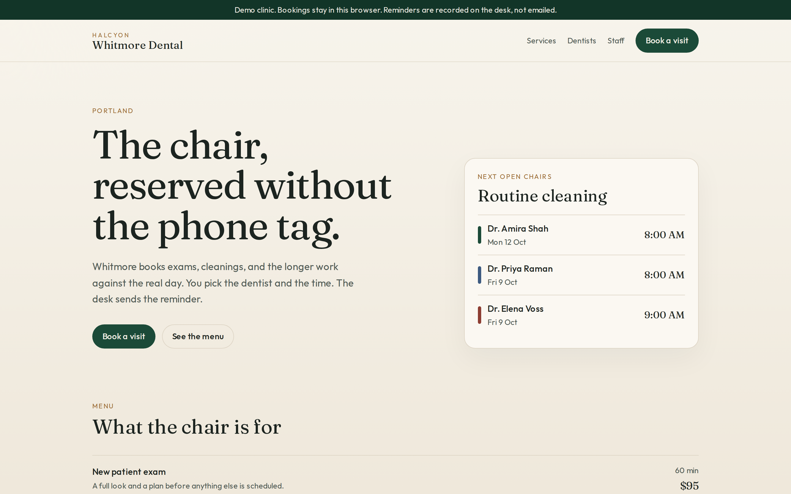
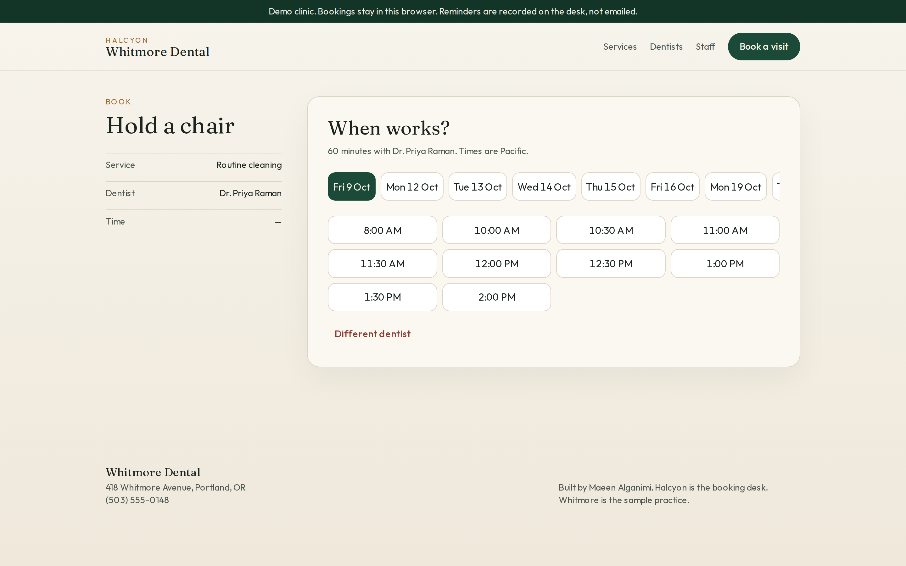
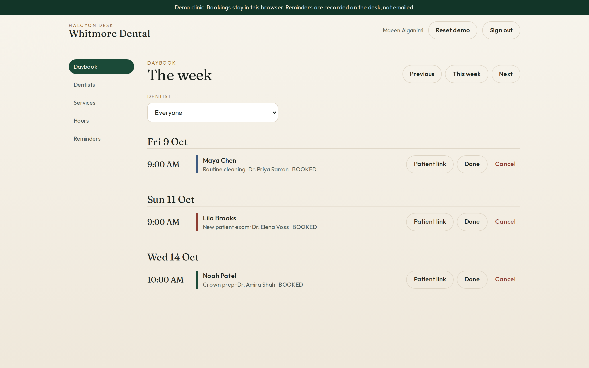
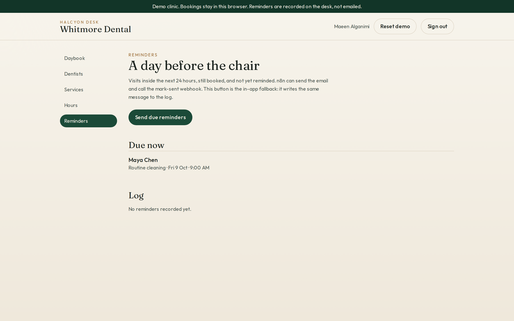
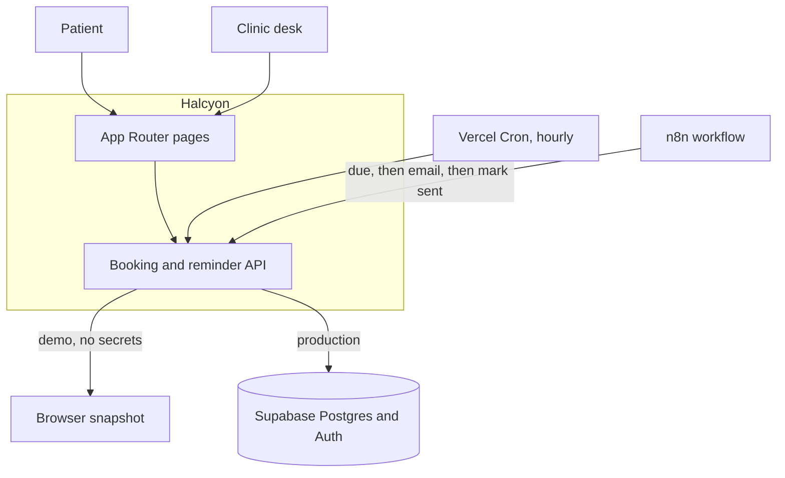

# Halcyon

Halcyon is the booking desk for a dental clinic. A patient picks the work, the dentist, and an open chair. The practice reminds them a day before, and the same link moves or cancels the visit.

Maeen Alganimi built it as a portfolio piece for the freelance work he does with dental clinics. The sample practice is Whitmore Dental at 418 Whitmore Avenue, Portland.

Live demo: coming soon (not deployed yet)

Demo mode needs no API keys. Clone the repo, install, and run. A Vercel project with an empty environment shows the same clinic.

Desk login: `staff@whitmore.dental` / `whitmore-demo`

## Screenshots

The front door. Services, dentists, and the next open cleaning.



A patient choosing a time with Dr. Raman.



The desk, looking at the week. Maya Chen’s cleaning is inside the reminder window.



Reminders that are due. The desk can record them here. n8n can email them.



## What it does

Patients

- Read the menu and the dentists.
- Take a slot that is actually open: working hours, minus booked visits, minus time off.
- Leave a name, email, and phone. The confirmation includes a private manage link.
- Reschedule or cancel from that link. Cancelling frees the chair.

Clinic staff

- Sign in to a desk with a week view of the book.
- Mark a visit done or cancelled.
- Add and edit dentists, the services they offer, weekly hours, and closures.
- See which reminders are due, send them from the desk, and read the log.

Reminders

- A booked visit with no reminder, starting inside the next 24 hours, is due.
- `n8n/appointment-reminders.json` runs hourly: it reads `/api/reminders/due`, sends the email, then calls `/api/reminders/mark-sent`.
- `/api/cron/reminders` does the same job inside the app. Vercel Cron hits it every hour (`vercel.json`). The desk button calls it too, and writes the message to the log with channel `in_app`.

## Architecture



Demo requests carry the book in the body and get the next snapshot back. The browser stores it in `localStorage`. Production ignores that header and reads Postgres with the service role. Staff sign-in in production is Supabase Auth, and only a row in `staff_profiles` opens the desk.

## Decisions

**Slots are computed.** There is no slot table to drift out of date. Working hours, a 30-minute grid, the service length, a 60-minute lead, and a 21-day window produce the choices. A closure is a `time_off` row. That is how the desk “manages slots.”

**The database refuses a double book.** `appointments_no_double_booking` is a `gist` exclusion constraint on `(dentist_id, tstzrange(starts_at, ends_at, '[)'))` for rows with status `booked`. A visit that ends at 11:00 can be followed by one that starts at 11:00. Cancelled and completed visits release the chair. The app checks first and maps SQLSTATE `23P01` to a plain “that time is no longer open.”

**Demo mode is a real client of the same repository.** The memory store and the Supabase store implement one interface. Recruiters can click through a deploy with zero secrets. The snapshot is for the sample clinic. It is the wrong place for patient health information. Two browser tabs can still race; the exclusion constraint is the lock that matters once Supabase is connected.

**Reminders have two triggers and one message.** `selectDueReminders` and `composeReminder` are shared. n8n owns delivery to a mailbox. The cron route owns the case where n8n is not connected, and it records the same copy in `reminder_log`. Rescheduling clears `reminder_sent_at`, so the new time can be reminded again.

**The service role stays on the server.** The browser holds the anon key only in production, and Row Level Security is in `supabase/migrations/002_rls.sql`. That file is separate because it depends on `auth.users`. The schema and seed apply on vanilla Postgres, which is what CI uses.

## Run it locally

Node 22.

```bash
npm ci
npm run dev
```

Open http://localhost:3000. Copy `.env.example` to `.env.local` only when you want to point at Supabase. Empty Supabase variables mean demo mode.

| Script | What it does |
| --- | --- |
| `npm run dev` | Next.js dev server |
| `npm run lint` | ESLint |
| `npm run typecheck` | `tsc --noEmit` |
| `npm test` | Vitest. Booking rules, the HTTP dispatch, and the n8n workflow shape. The Postgres exclusion test runs when `DATABASE_URL` is set. |
| `npm run test:e2e` | Playwright against `next start`. A patient books and cancels. Staff send a reminder. |
| `npm run build` | Production build |

GitHub Actions (`.github/workflows/ci.yml`) runs lint, typecheck, unit tests, the build, and Playwright on every push and pull request. The job starts Postgres 16 and sets `DATABASE_URL`, so the exclusion constraint is exercised there.

## Deploy

### Demo on Vercel

Import the repository. Leave the environment empty. The hourly cron still calls `/api/cron/reminders`. With no `CRON_SECRET`, demo mode accepts `demo-cron-secret`. Serverless instances do not share the in-memory book, so the desk button (which sends the browser snapshot) is the reminder path to show a recruiter. Replace the live demo line at the top of this file with the deployment URL.

### A real clinic on Supabase

1. Create a Supabase project.
2. In the SQL editor, run `supabase/migrations/001_schema.sql`, then `supabase/migrations/002_rls.sql`, then `supabase/seed.sql`. The first file enables `btree_gist`.
3. Create a staff user in Authentication. Copy the user id.
4. Attach that user to Whitmore:

```sql
insert into staff_profiles (user_id, clinic_id, full_name, role)
values (
  'PASTE_AUTH_USER_ID',
  '11111111-1111-4111-8111-111111111111',
  'Maeen Alganimi',
  'owner'
);
```

5. On Vercel, set:

| Variable | Purpose |
| --- | --- |
| `NEXT_PUBLIC_DATA_MODE` | `supabase` |
| `NEXT_PUBLIC_SUPABASE_URL` | Project URL |
| `NEXT_PUBLIC_SUPABASE_ANON_KEY` | Anon key, used for staff sign-in |
| `SUPABASE_SERVICE_ROLE_KEY` | Server only. Writes the book |
| `NEXT_PUBLIC_APP_URL` | Public origin, no trailing slash. Reminder links use it |
| `CRON_SECRET` | Shared by Vercel Cron and n8n |

`DEMO_STAFF_EMAIL`, `DEMO_STAFF_PASSWORD`, and `DEMO_SESSION_SECRET` matter only in demo mode. See `.env.example`.

6. Import `n8n/appointment-reminders.json`. Set `HALCYON_APP_URL`, `HALCYON_CRON_SECRET` (the same value as `CRON_SECRET`), and `REMINDER_FROM`. Attach SMTP credentials to the email node, then activate the workflow. The workflow file ships inactive and contains no mailbox password.

Vercel Cron sends `Authorization: Bearer $CRON_SECRET` to `/api/cron/reminders`. If both cron and n8n run, the first one to mark `reminder_sent_at` wins and the other finds nothing due.

## License

MIT. See [LICENSE](LICENSE).
